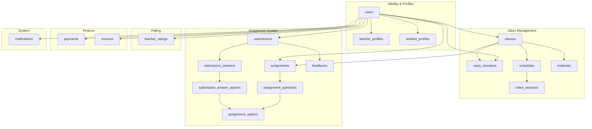

# Database Relationships Documentation

## Overview

Tài liệu này mô tả các mối quan hệ giữa các bảng trong hệ thống quản lý lớp học trực tuyến **LearnMate**.  
Database sử dụng **PostgreSQL** với các quan hệ One-to-One, One-to-Many và Many-to-Many.

---

### Các Module Chính

| #   | Module                | Mô tả                          |
| --- | --------------------- | ------------------------------ |
| 1   | **User Management**   | Quản lý người dùng, phân quyền |
| 2   | **Class Management**  | Quản lý lớp học, thành viên    |
| 3   | **Scheduling**        | Lịch học, phòng video          |
| 4   | **Assignment System** | Bài tập, câu hỏi, đáp án       |
| 5   | **Teacher Ratings**   | Đánh giá giáo viên             |
| 6   | **Payment System**    | Thanh toán, hóa đơn            |
| 7   | **Notifications**     | Thông báo hệ thống             |

---

## 1. Users

Bảng `users` chỉ lưu thông tin **xác thực (auth)**. Các thông tin đặc thù của từng role được tách sang bảng profile riêng.

| Field           | Mô tả                           |
| --------------- | ------------------------------- |
| `id`            | Primary key                     |
| `email`         | Email đăng nhập (unique)        |
| `password_hash` | Mật khẩu đã hash                |
| `role`          | `STUDENT` / `TEACHER` / `ADMIN` |
| `is_active`     | Trạng thái tài khoản            |
| `created_at`    | Thời điểm tạo                   |

> [!NOTE]
> Không lưu thông tin cá nhân (tên, ảnh, bio, v.v.) trực tiếp trong `users`. Tất cả được delegate sang `teacher_profiles` hoặc `student_profiles`.

### Relationships

#### Users → Teacher Profile (One-to-One)

> Mỗi user có role `TEACHER` có đúng một profile giáo viên.

```
   users
     1
     │
     │ has one
     ▼
     1
teacher_profiles
```

```sql
-- Foreign key
teacher_profiles.user_id → users.id

-- Các fields trong teacher_profiles:
-- full_name, avatar_url, bio, subjects, hourly_rate,
-- rating_avg, total_rating_count, bank_account
```

---

#### Users → Student Profile (One-to-One)

> Mỗi user có role `STUDENT` có đúng một profile học sinh.

```
   users
     1
     │
     │ has one
     ▼
     1
student_profiles
```

```sql
-- Foreign key
student_profiles.user_id → users.id

-- Các fields trong student_profiles:
-- full_name, avatar_url, date_of_birth, grade_level, parent_contact
```

---

#### Users → Classes

> Một giáo viên có thể tạo nhiều lớp.

```
users (teacher)
      1
      │
      │ has many
      ▼
      N
   classes
```

```sql
-- Foreign key
classes.teacher_id → users.id
```

---

#### Users → Class Members

> Một học sinh có thể tham gia nhiều lớp.

```
users (student)
      1
      │
      │ joins many
      ▼
      N
class_members
```

```sql
-- Foreign key
class_members.student_id → users.id
```

---

#### Users → Assignments

> Một giáo viên có thể tạo nhiều bài tập.

```
   users
     1
     │
     │ creates many
     ▼
     N
assignments
```

```sql
-- Foreign key
assignments.teacher_id → users.id
```

---

#### Users → Submissions

> Một học sinh có thể nộp nhiều bài tập.

```
   users
     1
     │
     │ submits many
     ▼
     N
submissions
```

```sql
-- Foreign key
submissions.student_id → users.id
```

---

#### Users → Materials

> Một giáo viên có thể upload nhiều tài liệu.

```
  users
    1
    │
    │ uploads many
    ▼
    N
materials
```

```sql
-- Foreign key
materials.uploaded_by → users.id
```

---

#### Users → Notifications

> Một user có thể có nhiều thông báo.

```
      users
        1
        │
        │ receives many
        ▼
        N
notifications
```

---

#### Users → Payments

> Một học sinh có thể thực hiện nhiều thanh toán.

```
  users
    1
    │
    │ makes many
    ▼
    N
payments
```

---

#### Users → Invoices

> Một giáo viên có thể có nhiều hóa đơn.

```
  users
    1
    │
    │ receives many
    ▼
    N
invoices
```

---

## 2. Classes

Bảng `classes` lưu thông tin lớp học.

#### Classes ↔ Students (Many-to-Many)

> Học sinh và lớp học có quan hệ **Many-to-Many**, thông qua bảng trung gian `class_members`.

```
students  N ────── class_members ────── N  classes
```

```sql
-- Foreign keys
class_members.class_id   → classes.id
class_members.student_id → users.id

-- Unique constraint
UNIQUE (class_id, student_id)
```

---

#### Classes → Schedules

> Một lớp có nhiều buổi học. Teacher của buổi học được xác định qua `classes.teacher_id` — không lưu redundant `teacher_id` trong `schedules`.

```
classes
   1
   │
   ▼
   N
schedules
```

```sql
-- Foreign key
schedules.class_id → classes.id
```

---

#### Classes → Assignments

> Một lớp có nhiều bài tập.

```
 classes
    1
    │
    ▼
    N
assignments
```

---

#### Classes → Materials

> Một lớp có nhiều tài liệu.

```
 classes
    1
    │
    ▼
    N
materials
```

```sql
-- Foreign key
materials.class_id → classes.id
```

---

## 3. Scheduling System

#### Schedules → Video Sessions

> Một buổi học có **một** phòng video (One-to-One).

```
  schedules
      1
      │
      │ has one
      ▼
      1
video_sessions
```

```sql
-- Foreign key
video_sessions.schedule_id → schedules.id
```

> [!NOTE]
> Buổi học thử (trial lesson) không cần bảng riêng. Dùng column `is_trial BOOLEAN DEFAULT FALSE` trực tiếp trong bảng `schedules` để phân biệt.

---

## 4. Assignment System

#### Assignments → Questions

> Một bài tập có nhiều câu hỏi.

```
  assignments
       1
       │
       ▼
       N
assignment_questions
```

---

#### Questions → Options

> Một câu hỏi có nhiều đáp án.

```
assignment_questions
         1
         │
         ▼
         N
 assignment_options
```

---

## 5. Submission System

#### Assignments → Submissions

> Một bài tập có nhiều bài nộp.

```
 assignments
      1
      │
      ▼
      N
 submissions
```

```sql
-- Unique constraint (mỗi học sinh chỉ nộp 1 lần)
UNIQUE (assignment_id, student_id)
```

---

#### Submissions → Answers

> Một bài nộp có nhiều câu trả lời.

```
  submissions
       1
       │
       ▼
       N
submission_answers
```

---

#### Questions → Submission Answers

> Một câu hỏi có thể xuất hiện trong nhiều câu trả lời.

```
assignment_questions
         1
         │
         ▼
         N
 submission_answers
```

---

#### Submission Answers → Submission Answer Options

> Với câu hỏi trắc nghiệm (multiple choice), một câu trả lời ghi lại các **đáp án mà học sinh đã chọn** thông qua bảng `submission_answer_options`.

```
submission_answers
         1
         │
         ▼
         N
submission_answer_options
         N
         │
         ▼
         1
 assignment_options
```

```sql
-- Foreign keys
submission_answer_options.submission_answer_id → submission_answers.id
submission_answer_options.option_id            → assignment_options.id

-- Unique constraint (mỗi đáp án chỉ được chọn một lần trong một câu trả lời)
UNIQUE (submission_answer_id, option_id)
```

> [!NOTE]
> Câu hỏi tự luận (`ESSAY` type) không có `submission_answer_options` — nội dung được lưu trực tiếp trong `submission_answers.answer_text`. Bảng này chỉ dùng cho câu hỏi trắc nghiệm.

---

#### Submissions → Feedbacks

> Một bài nộp có tối đa **một** feedback từ giáo viên (One-to-One).

```
submissions
     1
     │
     │ has one
     ▼
     1
  feedbacks
```

---

## 6. Teacher Ratings

> Học sinh có thể đánh giá giáo viên sau mỗi lớp học.

```
students  N ────── teacher_ratings ────── N  teachers
                        │
                        N
                        │
                        ▼
                        1
                     classes
```

```sql
-- Foreign keys
teacher_ratings.student_id → users.id
teacher_ratings.teacher_id → users.id
teacher_ratings.class_id   → classes.id

-- Constraint: mỗi học sinh chỉ đánh giá một giáo viên một lần trong mỗi lớp
-- (có thể đánh giá lại nếu học cùng giáo viên ở lớp khác)
UNIQUE (student_id, teacher_id, class_id)
```

---

## 7. Payment System

#### Payments

> Thanh toán từ học sinh cho một lớp học cụ thể.

```
users (student)
      1
      │
      ▼
      N
  payments
      N
      │
      ▼
      1
  classes
```

```sql
-- Foreign keys
payments.student_id → users.id
payments.class_id   → classes.id   -- học sinh thanh toán cho lớp nào
```

---

#### Invoices

> Hóa đơn trả tiền cho giáo viên, phát sinh từ các payment của học sinh trong lớp.

```
users (teacher)
      1
      │
      ▼
      N
  invoices
      N
      │
      ▼
      1
  classes
```

```sql
-- Foreign keys
invoices.teacher_id → users.id
invoices.class_id   → classes.id   -- hóa đơn thuộc lớp nào
```

---

#### Payments ↔ Invoices

> Một invoice tổng hợp nhiều payment của học sinh trong cùng một lớp (ví dụ: thanh toán theo tháng).

```
payments  N ──────────────────── 1  invoices
```

```sql
-- Foreign key (mỗi payment thuộc về tối đa một invoice)
payments.invoice_id → invoices.id   -- nullable: NULL khi payment chưa được gộp vào invoice
```

---

## 8. Notifications

> Thông báo của hệ thống cho user.

```
      users
        1
        │
        ▼
        N
notifications
```

---

## 9. Database Module Overview

Tổng quan phân chia database theo module:



### Danh sách bảng theo module

| Module                | Bảng                                                                                                          |
| --------------------- | ------------------------------------------------------------------------------------------------------------- |
| **Identity**          | `users`, `teacher_profiles`, `student_profiles`                                                               |
| **Class Management**  | `classes`, `class_members`, `schedules` _(+`is_trial`)_, `video_sessions`, `materials`                        |
| **Assignment System** | `assignments`, `assignment_questions`, `assignment_options`, `submissions`, `submission_answers`, `submission_answer_options`, `feedbacks` |
| **Rating**            | `teacher_ratings`                                                                                             |
| **Finance**           | `payments`, `invoices`                                                                                        |
| **System**            | `notifications`                                                                                               |
