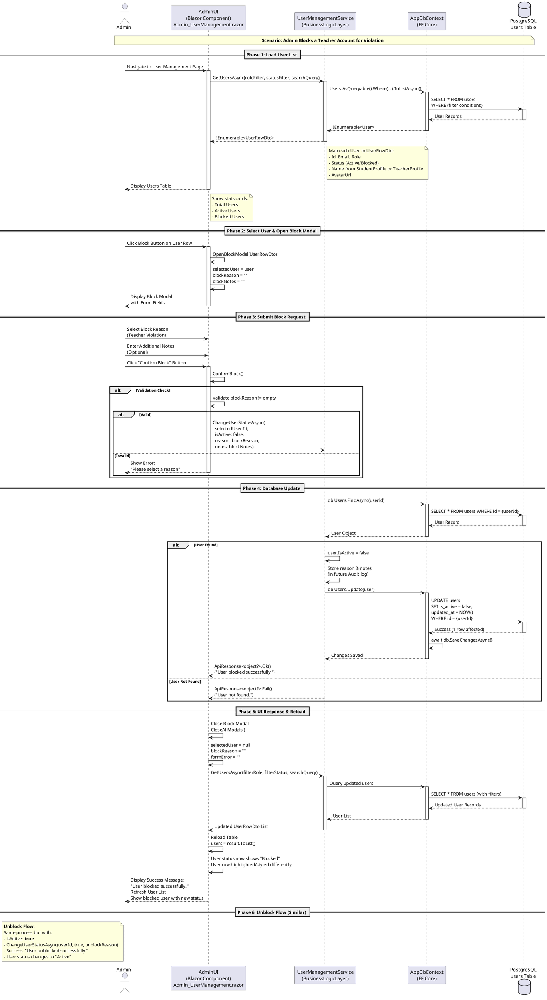

# User Management: Block/Unlock Account - PlantUML Diagrams

Based on the source code analysis, here are 3 detailed diagrams for the user account management (lock/unlock) feature.

## 1. ACTIVITY DIAGRAM - User Account Lock/Unlock Flow

This diagram shows the complete activity flow of how an admin blocks or unblocks a user account.

```plantuml
@startuml admin_user_account_management_activity

start
:Admin Access User Management;
:Page Loads - GetUsersAsync();
note on the right
  ""GetUsersAsync(roleFilter, statusFilter, searchQuery)""
  - Filter by Role (Student/Teacher/Admin)
  - Filter by Status (Active/Blocked)
  - Search by email/name
end note

:Display User List;
:Admin Search/Filter Users;
:Admin Selects User from Table;

split
  :Block User Path;
  :Admin Clicks "Block" Button;
  :Open Block Modal;
  :Admin Enters Block Reason;
  :Admin Enters Optional Notes;
  :Admin Clicks "Confirm Block";
  :Validate Reason NOT Empty;
  if (Validation Passed?) then
    :Call ChangeUserStatusAsync(userId, **false**, reason, notes);
    :UserManagementService Processing;
    note on the right
      user = ""db.Users.FindAsync(userId)""
      if user != null:
        user.IsActive = **false**
        db.Users.Update(user)
        await db.SaveChangesAsync()
      else:
        Return error
    end note
    :Check User Exists;
    if (User Found?) then
      :Set User.IsActive = false;
      :Save to PostgreSQL Database;
      :Return Success Response;
      :Close Block Modal;
      :Reload User List - GetUsersAsync();
      :Display User Status = Blocked;
      :Show Success Message;
    else
      :Return Error Message;
      :Display "User not found.";
    endif
  else
    :Display Validation Error;
    :Show "Please select a reason";
  endif

split again
  :Unblock User Path;
  :Admin Clicks "Unblock" Button;
  :Open Unblock Modal;
  :Admin Enters Unblock Reason;
  :Admin Clicks "Confirm Unblock";
  :Validate Reason NOT Empty;
  if (Validation Passed?) then
    :Call ChangeUserStatusAsync(userId, **true**, reason);
    :UserManagementService Processing;
    note on the right
      user = ""db.Users.FindAsync(userId)""
      if user != null:
        user.IsActive = **true**
        db.Users.Update(user)
        await db.SaveChangesAsync()
      else:
        Return error
    end note
    :Check User Exists;
    if (User Found?) then
      :Set User.IsActive = true;
      :Save to PostgreSQL Database;
      :Return Success Response;
      :Close Unblock Modal;
      :Reload User List - GetUsersAsync();
      :Display User Status = Active;
      :Show Success Message;
    else
      :Return Error Message;
      :Display "User not found.";
    endif
  else
    :Display Validation Error;
    :Show "Please select a reason";
  endif

end split

:Admin View Updated User List;
stop

@enduml
```

---

## 2. STATE DIAGRAM - User Account State Transitions

This diagram shows all possible states of a user account and the transitions between them.

```plantuml
@startuml user_account_state_diagram

[*] --> Creating: CreateUserAsync(\nnewUser: NewUserRequestDto)

Creating --> Active: User.IsActive = true\n(Default State)

Active --> Active: ReloadUserList

Active --> Blocked: ChangeUserStatusAsync(\nuserid, **false**, reason)\n[Reason: Teacher Violation\nor Account Abuse]

Blocked --> Active: ChangeUserStatusAsync(\nuserId, **true**, unblockReason)\n[Appeal Approved]

Blocked --> Blocked: ReloadUserList

Active --> SoftDeleted: DeleteUserAsync(userId)\n[Set user.DeletedAt = UtcNow()]

Blocked --> SoftDeleted: DeleteUserAsync(userId)\n[Set user.DeletedAt = UtcNow()]

SoftDeleted --> [*]: Permanent Removal\nor Archive

note on the left of Creating
  **Creating State**
  - New user account initialized
  - Password hashed with BCrypt
  - User.IsActive = true (default)
  - StudentProfile or TeacherProfile created
  - Duration: Immediate
end note

note on the right of Active
  **Active State**
  - User.IsActive = true
  - User can login to system
  - Full access based on role
  - Duration: Unlimited unless blocked
end note

note on the left of Blocked
  **Blocked State**
  - User.IsActive = false
  - Cannot access system
  - Block reason stored in notes
  - For Teachers: May be due to:
    * Compliance rejection
    * Policy violation
    * Appeal
end note

note on the right of SoftDeleted
  **Soft Deleted State**
  - user.DeletedAt != null
  - User record NOT physically deleted
  - User data preserved for audit
  - Cannot login anymore
  - Admin can restore if needed
end note

@enduml
```

---

## 3. COMMUNICATION DIAGRAM - System Component Interactions

This diagram shows how different system components communicate during user account lock/unlock operations.



---

## Data Model Summary

### User Entity (BusinessObject/Models/Identity/User.cs)
```csharp
public class User : SoftDeletableEntity
{
    public string Email { get; set; }
    public string PasswordHash { get; set; }
    public UserRole Role { get; set; }
    public bool IsActive { get; set; } = true;  // KEY FIELD: false = blocked
    public string? AvatarUrl { get; set; }
    public DateTime? DeletedAt { get; set; }     // NULL = active, NOT NULL = soft deleted
}
```

### UserManagementService Methods (BusinessLogicLayer/Services/UserManagementService.cs)
```csharp
// Get all users with filters
public Task<IEnumerable<UserRowDto>> GetUsersAsync(
    string roleFilter = "", 
    string statusFilter = "", 
    string searchQuery = "")

// Block or Unblock a user
public Task<ApiResponse<object?>> ChangeUserStatusAsync(
    long userId, 
    bool isActive,        // true = unblock, false = block
    string reason, 
    string notes = "")

// Soft delete user
public Task<ApiResponse<object?>> DeleteUserAsync(long userId)
```

### UserRole Enum (BusinessObject/Enum/UserRole.cs)
- ADMIN
- TEACHER
- STUDENT

---

## Key Business Rules

1. **User Active States:**
   - `IsActive = true`: User is ACTIVE (can login)
   - `IsActive = false`: User is BLOCKED (cannot login)
   - `DeletedAt != null`: User is SOFT DELETED (archived)

2. **Block Reasons (from UI):**
   - Teacher Violation
   - Account Abuse
   - Compliance Rejection
   - Policy Violation
   - Admin Discretion

3. **Workflow:**
   - Admin can block any user (Student/Teacher/Admin)
   - Block reason is logged (currently in notes, could be Audit table)
   - User cannot access system while blocked
   - Unblock restores full access
   - Soft delete preserves data for compliance

4. **Database (PostgreSQL):**
   - Table: `users`
   - Column: `is_active` (BOOLEAN, DEFAULT true)
   - Column: `deleted_at` (TIMESTAMPTZ NULL)
   - Column: `updated_at` (TIMESTAMPTZ auto-updated)

